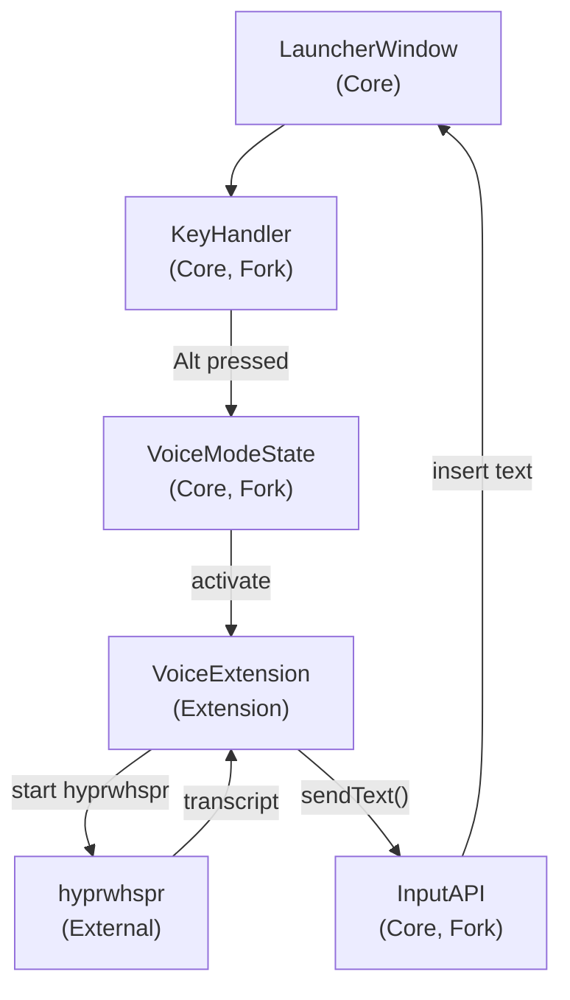
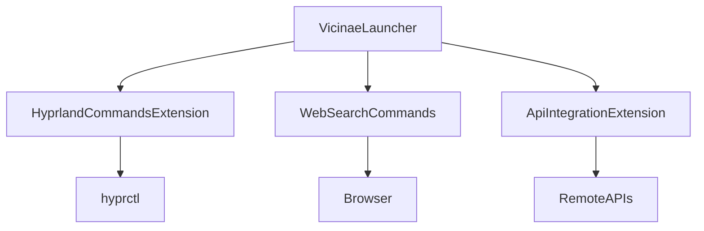

## Ziel

Vicinae so ausbauen, dass es sich unter Arch Linux + Hyprland wie ein Raycast‑ähnlicher Launcher anfühlt, mit Fokus auf Websuche, API-Integrationen und einer kuratierten Window-Management-Erfahrung.

## 1. Ist-Analyse der Vicinae-Features

- **Dokumentation sichten**: Die offizielle Doku (`https://docs.vicinae.com/`) und insbesondere die Kapitel zu `Quickstart`, `Manual` und `Extensions` durchgehen.
- **Feature-Mapping erstellen**: Für jedes deiner Kernfeatures prüfen, ob es bereits existiert, teilweise existiert (über Script Commands / Extensions) oder komplett fehlt.

### 1.1 Abgleich mit deiner Feature-Liste

- **Window Management**
  - Laut Manual gibt es bereits ein Modul `Window Management` (z.B. Fokus wechseln, Fenster verschieben, Desktop/Workspace wechseln).
  - Für Hyprland-spezifische Aktionen (z.B. `hyprctl dispatch`) ist eine Erweiterung via Script Commands oder Extension nötig.
- **App Launching**
  - Kernfunktionalität von Vicinae: Launcher-Fenster mit App-Suche und Starten von Anwendungen.
- **Framework/Erweiterbarkeit**
  - Bereits vorhanden über **Extensions** (React/TypeScript, serverseitig) und **Script Commands** mit Raycast-Kompatibilität.
  - Gute Basis, um eigene Commands für Websuche, APIs, Hyprland etc. zu bauen.
- **Clipboard Manager**
  - In der Doku als `Clipboard Management` und separates Kapitel `Clipboard Server` erwähnt; unterstützt Zwischenablage-Historie und Integration in den Launcher.
- **Websuchen**
  - Kein dediziertes "Search the Web"-Modul dokumentiert, aber sehr einfach über Script Commands / Extensions zu bauen (z.B. Eingabe → URL öffnen oder HTTP-Request ausführen).
- **API-Integrationen**
  - Über Script Commands (Shell, Node, etc.) und Extensions gut abbildbar: HTTP-Requests, Auth, Parsing.
- **Diktiermodus (hyprwhspr)**
  - Nicht Teil der Standardmodule; muss als integriertes Command/Extension entwickelt werden, die `hyprwhspr` startet, Status anzeigt und Resultat in den Fokus-Input / Clipboard schreibt.
- **Taschenrechner**
  - Bereits als `Calculator`-Modul in der Doku genannt.
- **Systemeinstellungen**
  - Kein generisches Systemsettings-Modul, aber über App-Shortcuts/Script Commands können gezielte Einstellungen (Hyprland, PipeWire, Powerprofile, etc.) verlinkt werden.
- **Terminal Commands**
  - Vicinae kann eine Standard-Terminal-App starten und über Script Commands Shell-Befehle ausführen.
  - Explizites "Erkenne eingegebene Shell-Commands und öffne sie im Terminal" ist nicht dokumentiert und wäre ein Add-on.
- **Screenshot**
  - Kein dediziertes Screenshot-Modul erwähnt; über Script Commands (z.B. `grimblast`, `hyprshot`) gut abbildbar.
- **Gamemode (Shortcuts ausstellen)**
  - Kein Core-Feature; könnte als globaler Schalter in Vicinae (Config + Keybinding-Handling / Hyprland-Binds) oder als Hyprland-Profile (über `hyprctl`) implementiert werden.

## 2. Zielbild für Hyprland + deine Prioritäten

- **Fokus laut deiner Antwort**
  - **Prio 1**: Websuchen + API-Integrationen → basieren auf `Script Commands` und `Extensions`.
  - **Hyprland-Tiefe**: "Medium" → Kuratierte Window-Management-Commands, die Hyprland-Dispatches kapseln (Layouts, Workspace/Monitor-Bewegungen, Floating/Tiling-Toggles).

- **Erstes Zielbild**
  - Ein "Command-Palette"-Erlebnis, in dem du:
    - Web-Suchen (Google, DuckDuckGo, DevDocs etc.) direkt aus Vicinae triggern kannst.
    - API-basierte Commands (z.B. Todo-API, Notizen, DevOps-Checks) ausführst.
    - Hyprland-Fenster- und Workspace-Operationen über sprechende Commands steuerst.

## 3. Geplante technische Umsetzung (hohe Ebene)

### 3.1 Basis: Vicinae-Fork sichten

- **Code-Struktur verstehen**
  - Prüfen, wie das Launcher Window, Module/Commands und Extensions technisch angebunden sind.
  - Identifizieren, wo Hyprland-spezifische Logik ideal aufgehängt wird (z.B. eigene Extension `vicinae-hyprland-tools`).

- **Arch Linux / Hyprland-spezifische Annahmen festhalten**
  - Abhängigkeit auf `hyprctl` und ggf. `jq` o.Ä.
  - Übliche Screenshot-Tools (z.B. `grim`, `slurp`, `grimblast`).

### 3.1.1 Extension-Entwicklung: Organisation im Fork

**Wie Vicinae Extensions lädt:**

- Extensions werden aus `~/.local/share/vicinae/extensions` (lokales User-Verzeichnis, höchste Priorität) und `$XDG_DATA_DIRS/vicinae/extensions` (systemweit) gescannt.
- Script Commands werden aus `$XDG_DATA_DIRS/vicinae/scripts` und konfigurierbaren Custom-Pfaden geladen.

**Empfehlung für deinen Fork:**

- **Extensions im Repo entwickeln** (z.B. `castomat/extensions/hyprland-tools/`, `castomat/extensions/web-search/`, `castomat/extensions/api-client/`).
- **Script Commands im Repo** (z.B. `castomat/scripts/web-search/`, `castomat/scripts/screenshot/`).
- **Development-Workflow:**
  - Während der Entwicklung: Symlinks von `~/.local/share/vicinae/extensions/` → `castomat/extensions/` (oder Custom Script Path auf Repo zeigen).
  - Oder: Build-Script, das Extensions/Scripts ins User-Verzeichnis kopiert.
  - Vorteil: Alles versioniert, zusammen mit Core-Änderungen (z.B. Voice-Mode-API) entwickelbar, einfaches Testing.

**Warum nicht "einfach externe Extensions"?**

- Für Voice-Mode brauchst du Core-Änderungen (Key-Handling, Input-API). Diese Extensions müssen **zusammen mit dem Fork** entwickelt werden.
- Konsistente Versionierung: Deine Extensions können Features nutzen, die erst im Fork existieren.
- Einfacheres Testing: Alles in einem Repo, CI/CD kann alles zusammen bauen/testen.
- Später auslagerbar: Wenn stabil, können Extensions als separate Pakete/Repos gepflegt werden.

### 3.1.2 Voice-Mode: Fork vs. Extension

**Dein Wunsch:** Launcher öffnen → Modifier-Taste (z.B. `Alt`) halten → sprechen → Text landet im Input-Feld.

**Warum das einen Fork braucht:**

- **Core-Änderungen nötig:**
  - Key-Handling im Launcher-Window: Modifier-Taste (`Alt`, `Ctrl`, etc.) muss **vor** normalem Input-Verhalten abgefangen werden.
  - Voice-Mode-State: Globaler Zustand "Voice-Mode aktiv", der das normale Input-Verhalten überschreibt.
  - Input-API für Extensions: Möglichkeit, Text programmatisch ins Haupt-Eingabefeld zu schreiben (aktuell nicht standardmäßig verfügbar).

- **Extension-Layer:**
  - `hyprwhspr`-Integration: Prozess starten/stoppen, Audio aufnehmen, Transkription abrufen.
  - Statusanzeige: UI-Komponente, die zeigt, ob Aufnahme läuft.
  - Text an Core weiterleiten: Über die neue Input-API den transkribierten Text ins Hauptfeld pushen.

**Architektur-Skizze:**



**Fazit:** Voice-Mode ist ein **Hybrid**: Core-Änderungen (Key-Handling, State, Input-API) + Extension (hyprwhspr-Integration, UI). Beides zusammen im Fork entwickeln macht Sinn.

### 3.2 Websuche-Extension: Konkrete Struktur

**Ziel:** Erste Extension als Einstieg ins Framework. Einfache, aber vollständige Implementierung.

**Verzeichnisstruktur:**

```
castomat/
└── extensions/
    └── web-search/
        ├── package.json              # Extension-Manifest
        ├── tsconfig.json              # TypeScript-Config
        ├── assets/
        │   └── icon.png              # 512x512 Extension-Icon
        └── src/
            ├── google.tsx            # Google-Suche Command
            ├── duckduckgo.tsx        # DuckDuckGo-Suche Command
            ├── arch-wiki.tsx         # Arch Wiki-Suche Command
            ├── github.tsx            # GitHub-Suche Command
            ├── stackoverflow.tsx     # Stack Overflow-Suche Command
            └── search-all.tsx         # View-Command: Alle Suchmaschinen
```

**Extension-Manifest (`package.json`):**

```json
{
  "$schema": "https://raw.githubusercontent.com/vicinaehq/vicinae/refs/heads/main/extra/schemas/extension.json",
  "name": "web-search",
  "title": "Web Search",
  "description": "Quick web searches from Vicinae - Google, DuckDuckGo, Arch Wiki, GitHub, Stack Overflow",
  "categories": ["Productivity", "Web"],
  "license": "MIT",
  "author": "p-pfeiffer",
  "icon": "icon.png",
  "commands": [
    {
      "name": "google",
      "title": "Search Google",
      "description": "Search Google for your query",
      "mode": "no-view",
      "keywords": ["google", "search", "web"]
    },
    {
      "name": "duckduckgo",
      "title": "Search DuckDuckGo",
      "description": "Search DuckDuckGo for your query",
      "mode": "no-view",
      "keywords": ["duckduckgo", "ddg", "search", "privacy"]
    },
    {
      "name": "arch-wiki",
      "title": "Search Arch Wiki",
      "description": "Search the Arch Linux Wiki",
      "mode": "no-view",
      "keywords": ["arch", "wiki", "linux", "documentation"]
    },
    {
      "name": "github",
      "title": "Search GitHub",
      "description": "Search GitHub repositories and code",
      "mode": "no-view",
      "keywords": ["github", "git", "code", "repositories"]
    },
    {
      "name": "stackoverflow",
      "title": "Search Stack Overflow",
      "description": "Search Stack Overflow for programming questions",
      "mode": "no-view",
      "keywords": ["stackoverflow", "so", "programming", "questions"]
    },
    {
      "name": "search-all",
      "title": "Search All",
      "description": "Choose a search engine and enter your query",
      "mode": "view",
      "keywords": ["search", "web", "all"]
    }
  ],
  "preferences": [],
  "scripts": {
    "build": "vici build",
    "dev": "vici develop",
    "format": "biome format --write src",
    "lint": "vici lint"
  },
  "dependencies": {
    "@vicinae/api": "file:../../typescript/api"
  },
  "devDependencies": {
    "@biomejs/biome": "2.3.2",
    "@types/node": "^24.9.2",
    "@types/react": "^19.2.2",
    "typescript": "^5.9.2"
  }
}
```

**Command-Implementierungen:**

**1. No-View Commands (einfache Browser-Öffnung):**

`src/google.tsx` (mit Argumenten im Manifest):

```typescript
import { closeMainWindow, getArguments, open } from "@vicinae/api";

export default async function Google() {
  const args = await getArguments();
  const query = args.query as string;
  const url = `https://www.google.com/search?q=${encodeURIComponent(query)}`;
  
  await open(url);
  await closeMainWindow();
}
```

**Hinweis:** Für No-View Commands mit Argumenten muss das Manifest die Argumente definieren:

```json
{
  "name": "google",
  "title": "Search Google",
  "mode": "no-view",
  "arguments": [
    {
      "name": "query",
      "type": "text",
      "placeholder": "Search query",
      "required": true
    }
  ]
}
```

**2. View-Command (erweiterte Suche mit Auswahl):**

`src/search-all.tsx`:

```typescript
import { Action, ActionPanel, Icon, List, closeMainWindow } from "@vicinae/api";
import { useState } from "react";

type SearchEngine = {
  name: string;
  url: (query: string) => string;
  icon: Icon;
  keywords: string[];
};

const engines: SearchEngine[] = [
  {
    name: "Google",
    url: (q) => `https://www.google.com/search?q=${encodeURIComponent(q)}`,
    icon: Icon.MagnifyingGlass,
    keywords: ["google", "g"]
  },
  {
    name: "DuckDuckGo",
    url: (q) => `https://duckduckgo.com/?q=${encodeURIComponent(q)}`,
    icon: Icon.MagnifyingGlass,
    keywords: ["duckduckgo", "ddg", "privacy"]
  },
  {
    name: "Arch Wiki",
    url: (q) => `https://wiki.archlinux.org/index.php?search=${encodeURIComponent(q)}`,
    icon: Icon.Document,
    keywords: ["arch", "wiki", "linux"]
  },
  {
    name: "GitHub",
    url: (q) => `https://github.com/search?q=${encodeURIComponent(q)}`,
    icon: Icon.Code,
    keywords: ["github", "git", "code"]
  },
  {
    name: "Stack Overflow",
    url: (q) => `https://stackoverflow.com/search?q=${encodeURIComponent(q)}`,
    icon: Icon.QuestionMarkCircle,
    keywords: ["stackoverflow", "so", "programming"]
  }
];

export default function SearchAll() {
  const [query, setQuery] = useState("");

  return (
    <List
      searchBarPlaceholder="Enter search query..."
      searchText={query}
      onSearchTextChange={setQuery}
    >
      {query ? (
        engines.map((engine) => (
          <List.Item
            key={engine.name}
            title={`Search ${engine.name} for "${query}"`}
            subtitle={engine.name}
            icon={engine.icon}
            keywords={engine.keywords}
            actions={
              <ActionPanel>
                <Action.OpenInBrowser
                  title={`Open in ${engine.name}`}
                  url={engine.url(query)}
                />
              </ActionPanel>
            }
          />
        ))
      ) : (
        <List.EmptyView
          title="Enter a search query"
          icon={Icon.MagnifyingGlass}
          description="Type your search term to see available search engines"
        />
      )}
    </List>
  );
}
```

**Development-Workflow:**

1. **Extension erstellen:**
   ```bash
   cd castomat/extensions
   # Boilerplate kopieren oder manuell anlegen
   cp -r ../extra/extension-boilerplate web-search
   cd web-search
   # package.json anpassen
   npm install
   ```

2. **Symlink für Development:**
   ```bash
   # Extension ins User-Verzeichnis linken
   ln -s $(pwd) ~/.local/share/vicinae/extensions/web-search
   ```

3. **Development-Mode:**
   ```bash
   npm run dev  # Startet Hot-Reload für Extensions
   ```

4. **Build:**
   ```bash
   npm run build  # Baut Extension für Production
   ```


**Testing:**

1. Extension bauen: `npm run build`
2. Symlink erstellen: `ln -s $(pwd) ~/.local/share/vicinae/extensions/web-search`
3. Vicinae neu starten oder Extension Registry rescan lassen
4. In Vicinae testen: `google <query>` oder `search all` eingeben

**Nächste Schritte nach Web-Search:**

- Preferences hinzufügen (z.B. Standard-Suchmaschine, Custom-URLs)
- Optional: DuckDuckGo Instant API für Inline-Ergebnisse (View-Command mit API-Calls)
- Weitere Suchmaschinen (MDN, DevDocs, Reddit, etc.)
- Keyboard-Shortcuts für häufig genutzte Suchmaschinen

### 3.3 API-Integrations-Template

- **Generic API-Client Extension**
  - Eine React/TS-Extension, die über Konfiguration verschiedene REST-APIs ansprechen kann (Basis-URL, Auth-Header, Routen).
  - UI-Komponenten für Listen/Detail-Views (z.B. Issues, Todos, Deployments).
  - Re-usable Hooks (`useApiResource`) für schnelle neue Integrationen.

### 3.4 Hyprland Window-Management-Commands (Medium Integration)

- **No-View Commands für schnelle Aktionen**
  - Kommandos wie `focus window left`, `move window to workspace 3`, `toggle floating`, `move to monitor 2` die intern `hyprctl dispatch ...` aufrufen.

- **Optionale View-Command "Hyprland Overview"**
  - Listet aktuelle Workspaces und Fenster (über `hyprctl -j monitors`, `-j clients`).
  - Erlaubt Fokus-/Move-Aktionen direkt aus der Liste.

- **Mermaid-Skizze**



## 4. Erweiterungen für spätere Iterationen

- **Diktiermodus (hyprwhspr)**
  - No-View-Command zum Starten/Stoppen von `hyprwhspr` und Push in Clipboard / aktives Feld.
  - View-Command mit Statusanzeige (Aufnahme läuft, transkribiert, fertig).

- **Screenshot-Integration**
  - Commands wie `fullscreen screenshot`, `region screenshot to clipboard`, `window screenshot to file`.
  - Konfigurierbare Screenshot-Backends (grimblast, wf-recorder für Video etc.).

- **Gamemode / Shortcut-Suspension**
  - Globaler Schalter in Vicinae-Konfiguration, der bestimmte Shortcuts deaktiviert (oder Hyprland keybind-Gruppen umschaltet).
  - Visualer Indicator in Vicinae, ob Gamemode aktiv ist.

## 5. Ergebnis

Wenn wir diesen Plan umsetzen, hast du:

- Einen klaren Überblick, welche Raycast‑Features durch Vicinae-Core schon da sind und welche als Script Commands/Extensions hinzugefügt werden müssen.
- Einen fokussierten ersten Entwicklungs-Sprint auf Websuche + API-Integrationen und eine saubere, mitteltiefe Hyprland-Integration.
- Eine modulare Basis (Extensions/Script Commands), auf der du die restlichen Features wie Diktiermodus, Screenshot und Gamemode iterativ aufbauen kannst.